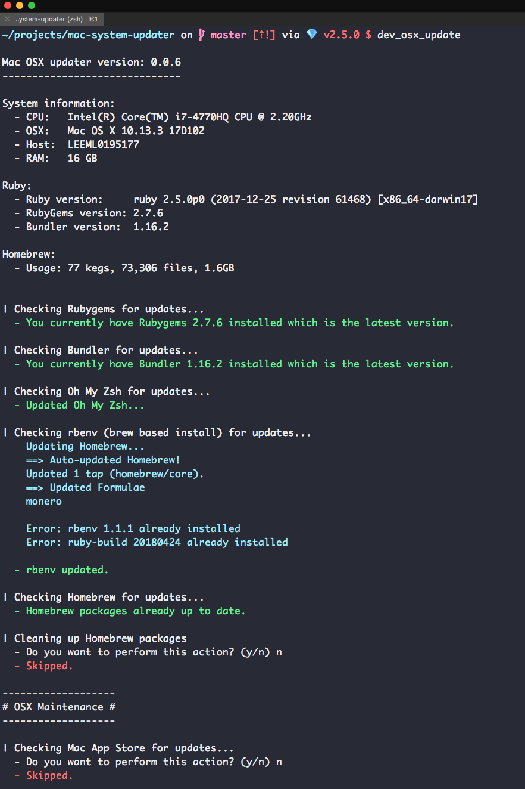

Mac OSX Ruby / Rails development environment updater
====================================================

### Compatability

* Ruby 2.1+ (this is due to Refinements changing a lot)

The script will check and update any of the following if installed:

* Rubygems gem
* Bundler gem
* OhMyZsh (performs git pull)
* Homebrew (performs brew update - NOT upgrade, there's a future feature in there to be done for upgrading)
* RVM (rvm get stable)
* rbenv (performs git pull)
* Mac App Store (Lists out all available MAS updates, currently doesn't have the functionality to install)

It also has the ability to cleanup old versions of Homebrew installed software and RVM sources/gems.

# Usage

You can automatically run all checks and updates by passing `--auto`, for example:

`dev_osx_update --auto`

Install
-------

Simply:

`gem install dev_osx_updater`

**NOTE: Please restart your terminal to activate the bin!**

Then run:

`dev_osx_update`

## Contributing

1. Fork it ( https://github.com/cbarratt/dev_osx_updater/fork )
2. Create your feature branch (`git checkout -b my-new-feature`)
3. Commit your changes (`git commit -am 'Add some feature'`)
4. Push to the branch (`git push origin my-new-feature`)
5. Create a new Pull Request
